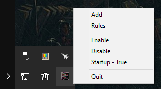
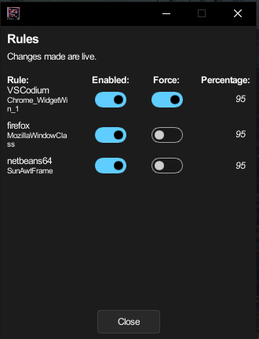
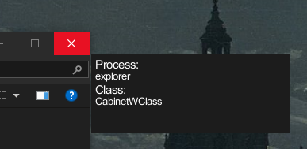

<div align="center">
 

# WinAlpha

Allows you to **set** the **transparency** of programs on **Windows**

<a href="https://github.com/tadghh/transparent-windows/releases/tag/v1.2.8">

</a>
</div>

## Features

- System tray integration
- Per-window transparency control
- Supports both standard and admin-level windows
- Memory efficient (~2MB idle, ~30MB active)

## Usage

1. Right-click tray icon to open menu
2. Click window frames to select target window
3. Adjust transparency (minimum 30%)

## Notes

- Admin rights required for elevated windows
- Click window frames for reliable window selection
- Some windows may not support transparency

## Building

```rust
cargo build --release
```
## Download
You can download a compiled version from the releases section on the right hand side.

## Examples

<table>
  <tr>
    <td style="vertical-align: top">
      <h2>Docs</h2>
      
    </td>
    <td style="vertical-align: top">
      <h2>File Explorer</h2>
      
    </td>
  </tr>
  <tr>
    <td style="vertical-align: top">
      <h2>Tray</h2>
      
    </td>
    <td style="vertical-align: top">
      <h2>Rules</h2>
      
    </td>
    <td style="vertical-align: top">
      <h2>Selection (Cursor not pictured)</h2>
      
    </td>
  </tr>
</table>
